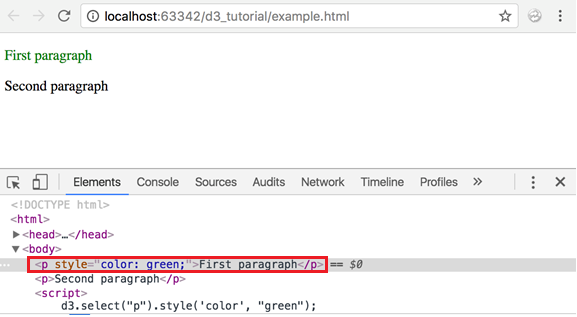
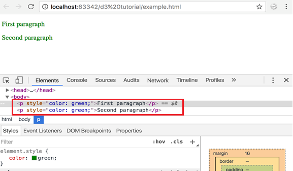

# D3.js Fundamentals

D3 stands for Data-Driven Documents. It is an open-source JavaScript library developed by Mike Bostock to create custom interactive data visualizations in the web browser using SVG, HTML and CSS.

These tutorials will help you learn the essentials of D3.js starting from the basics to an intermediate level. These tutorials are broken down into chapters, where each chapter contains a number of related topics that are packed with easy to understand explanations and real-world examples.

> **Prerequisites:** Basic knowledge of HTML, CSS and JavaScript is required.

## D3.js setup

In this chapter, we will learn how to setup D3.js development environment.

Before we start, you'll need the following components:

- D3 library
- Web server
- Editor
- Web browser

### D3 Library:

You need to include D3.js library into your HTML webpage in order to use D3 to create data visualization. You can do it in two ways:


> Include D3 library from CDN (Content Delivery Network).

Since D3 is an open-source library, the source code is freely available on the D3 website d3js.org.

Include D3 Library from CDN:
You can use D3 library by linking it directly to your HTML page from the Content Delivery Network (CDN). CDN is a network of servers where files are hosted and are delivered to a user based on their geographic location. If you use the CDN, you don't need to download the source code.

Include D3 library using CDN url https://d3js.org/d3.v4.min.js into your page as shown below.

```html
<!DOCTYPE html>
<html lang="en">
<head>
    <script src="https://d3js.org/d3.v4.min.js"></script>
</head>
<body>

<script>
    // write your d3 code here..
</script>
</body>
</html>
```

### Select DOM Elements using D3

D3 allows us to manipulate DOM elements in the HTML document and for that we first need to select a particular element, or a group of elements and then manipulate those elements using various D3 methods.

In this sect, we will learn about selecting DOM elements using D3.js methods.

This defines a global JavaScript object d3, which includes all the important methods to start with, just like jQuery includes a global object called jQuery (or `$`).

Before manipulating DOM elements, we need to get the reference of DOM elements using the following methods.


| Method                     | Description                              |
| -------------------------- | ---------------------------------------- |
| d3.select(css-selector     | Returns the first matching element in the HTML document based on specified css-selector |
| d3.selectAll(css-selector) | Returns all the matching elements in the HTML document based on specified css-selector |

#### d3.select():

The d3.select() method returns the first element in the HTML document based on specified css-elector.

**Select Element By Name:**

The following example demonstrates selecting the first matching element by tag name using d3.select.

```html
<!doctype html>
<html>
<head>
    <script src="https://d3js.org/d3.v4.min.js"></script>
</head>
<body>
    <p>First paragraph</p>
    <p>Second paragraph</p>

    <script>
        d3.select("p").style("color", "green");
    </script>
</body>
</html>
```

In the above example, `d3.select("p")` returns first `<p>` element and then, `.style("color","green")` method sets the color attribute to green. When you run this on your browser, this is how it will look:



You can see in the above result that the first paragraph has now been colored green. Open the developer tools (from Chrome settings > More Tools > Developer Tools). In the developer tools, under the Elements tab, you can see the paragraph elements and a style applied to the paragraphs.

**Select Element by Id:**

```javascript
d3.select("#p2").style("color", "green");
```

#### d3.selectAll():

The d3.selectAll() method returns all the matching elements in the HTML document based on specified CSS selector.

**Select Elements by Name:**

The following example selects all the elements by tag name.

```javascript
<!doctype html>
<html>
<head>
    <meta http-equiv="Content-type" content="text/html; charset=utf-8"/>
    <script src="https://d3js.org/d3.v4.min.js"></script>
</head>
<body>
    <p>First paragraph</p>
    <p>Second paragraph</p>
    <script>
        d3.selectAll("p").style("color", "green");
    </script>
</body>
</html>
```

In the above example, d3.selectAll("p") returns all the <p> element and .style("color","green") makes its font color green. When you run this on your browser, this is how it will look:



As you can see in the above result, it applied style attribute to all <p> elements.

**Select Elements by CSS Class Name:**

The following example demonstrates selection of elements by CSS class name.

```html
<!doctype html>
<html>
<head>
    <meta http-equiv="Content-type" content="text/html; charset=utf-8"/>
    <script src="https://d3js.org/d3.v4.min.js"></script>
    <style>
        .myclass{
            color:'red'
        }
    </style>
</head>
<body>
    <p class="myclass ">First paragraph</p>
    <p>Second paragraph</p>
    <p class="myclass ">Third paragraph</p>

    <script>
        d3.selectAll(".myclass ").style('color','green');
    </script>
</body>
</html>
```

In the above example, d3.selectAll(".myclass") will return all the elements whose css class is "myclass". Then .style() method sets the style attribute with the value color:green.


In the above example, first and third <p> element is colored green because both include "myClass".

**Select Nested Elements:**

The select() and selectAll() method can be used to select nested elements as shown below.

```html
<!doctype html>
<html>
<head>
    <script src="https://d3js.org/d3.v4.min.js"></script>
</head>
<body>
    <table>
    <tr>
        <td>
            One
        </td>
        <td>
            Two
        </td>
    </tr>
    <tr>
        <td>
            Three
        </td>
        <td>
            Four
        </td>
    </tr>
    </table>

    <script>
        d3.select("tr").selectAll("td").style('background-color','yellow');
    </script>
</body>
</html>
```


In the above example, d3.select("tr") returns the first matching <tr> element, then the selectAll("td") method returns all matching <td> elements within that <tr>. Finally, .style() method applies yellow background color to these <td>. Calling selectAll() method immediately after select() method is called **Method Chaining**.

Thus, you can use d3.select and d3.selectAll method to select matching DOM elements based on specified criteria. After DOM selection, learn how to manipulate DOM elements in the next section.

## DOM Manipulation using D3

In the previous section, we learned how to select DOM elements using D3. In this section, we will learn how to modify DOM elements.

D3 includes the following DOM manipulation methods that you can use after selecting elements using d3.select() or d3.selectAll().

| Method                                   | Description                              |
| ---------------------------------------- | ---------------------------------------- |
| text("content") | Gets or sets the text of the selected element |
| append("element name") | Adds an element inside the selected element but just before the end of the selected element. |
| insert("element name") | Inserts a new element in the selected element |
| remove() | Removes the specified element from the DOM |
| html("content") | Gets or sets the inner HTML of selected element |
| attr("name", "value") | Gets or sets an attribute on the selected element. |
| property("name", "value") | Gets or sets an attribute on the selected element. |
| style("name", "value") | Gets or sets the style of the selected element |
| classed("css class", bool) | Gets, adds or removes a css class from the selection |

## Method Chaining in D3


## References:

[1] http://www.tutorialsteacher.com/d3js