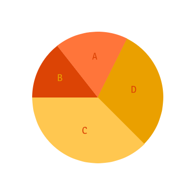

# Pie Chart



A pie chart is divided into sectors, illustrating numerical proportion. In a pie chart, the arc length of each sector (and consequently its central angle and area), is proportional to the quantity it represents. While it is named for its resemblance to a pie which has been sliced, there are variations on the way it can be presented.

[Live Demo](http://geoviz.ceoas.oregonstate.edu/neocarto/modules/charts/pie/index.html)

HTML

```html

<!DOCTYPE html>
<html lang="en">

<head>
    <meta charset="UTF-8">
    <meta name="viewport" content="width=device-width, initial-scale=1.0">
    <script src="https://d3js.org/d3.v4.min.js"></script>
    <link rel="stylesheet" href="https://cdnjs.cloudflare.com/ajax/libs/billboard.js/1.3.0/billboard.min.css">
    <script src="https://cdnjs.cloudflare.com/ajax/libs/billboard.js/1.3.0/billboard.js"></script>
</head>

<body>
    <div id="PieChart"></div>
   <script>

    </script>
</body>

</html>
```

Script

```javascript
var chart = bb.generate({
  data: {
    columns: [
	["data1", 15],
	["data2", 56],
    ["data3", 32],
    ["data4", 44]
    ],
    type: "pie",
    onclick: function (d, i) { console.log("onclick", d, i); },
    onover: function (d, i) { console.log("onover", d, i); },
    onout: function (d, i) { console.log("onout", d, i); }
    },
    pie: {
        title: "Pie Chart"
    },
    bindto: "#PieChart"
    });

    chart.data.colors({
    data4: "#FF753A",
    data1: "#EAA000",
    data2: "#FFC750",
    data3: "#DC4405"
    });
```

### More Examples
