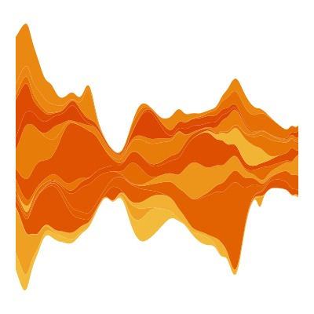

# Streamgraph Tutorial

**streamgraph** | **last updated 5/16/2018** | **for continuous data** | **Contributors:** (https://github.com/aradiafarmer)

[Live Demo](http://geoviz.ceoas.oregonstate.edu/neocarto/modules/charts/streamgraph_1/index.html)

Application: this particular streamgraph works with a random number generator to create paths,
and when the "update" button is pressed it will transition between two different randomly
generated sets of paths.

## 1\. Set up the workspace
<ul>
<li>Create repository in Github and create all needed subdirectories (index, assets, img, etc)
<li>Clone into computer, open in Webstorm
<li>Open index.html, main.css, main.js

First <li>Add the character set, title, SVG dimensions, and the D3 version 4 library

    <meta charset="utf-8">
    <title>Streamgraph</title>
    <svg width="400" height="400"></svg>
    

<li> add stylesheet and javascrip refernces

    <link rel="stylesheet" href="main.css"/>
    

## 2\. Data Sources
<li> data was impossible to add this tutorial at this time; stream paths were generated with a random
number generator contained in the original code

## 3\. A function-by-function Tutorial

#### html
<li> Button to transition the graph between two states

    <button onclick="transition()">Update</button>

#### javascript
<li>Define the variables that the graph will use to generate the visualization

    var n = 20, // number of layers
        m = 200, // number of samples per layer
        k = 10; // number of bumps per layer

<li>Define the stacking function for the streams in the graph

    var stack = d3.stack().keys(d3.range(n)).offset(d3.stackOffsetWiggle),
        layers0 = stack(d3.transpose(d3.range(n).map(function() { return bumps(m, k); }))),
        layers1 = stack(d3.transpose(d3.range(n).map(function() { return bumps(m, k); }))),
        layers = layers0.concat(layers1);

<li>Define the SVG the graph is going to use

    var svg = d3.select("svg"),
        width = +svg.attr("width"),
        height = +svg.attr("height");

<li>Add variables that will define the x and y axes by type and range

            var x = d3.scaleLinear()
                .domain([0, m - 1])
                .range([0, width]);

            var y = d3.scaleLinear()
                .domain([d3.min(layers, stackMin), d3.max(layers, stackMax)])
                .range([height, 0]);

1. var x defines the x-axis domain and range based on the number of samples and the width of the space
2. var y defines the y-axis domain and range based on the number of layers in the data

<li>Define the colors to be used

    var color = d3.scaleLinear() // these are the red and orange colors from the NeoCarto theme
        .range (['#dc4404','#f3bb3b'])
        .interpolate(d3.interpolateHcl);

<li>Create area of stream layers and stack them

    var area = d3.area()
        .x(function(d, i) { return x(i); })
        .y0(function(d) { return y(d[0]); })
        .y1(function(d) { return y(d[1]); });

    svg.selectAll("path")
      .data(layers0)
      .enter().append("path")
        .attr("d", area)
        .attr("fill", function() { return color(Math.random()); });

    function stackMax(layer) {
      return d3.max(layer, function(d) { return d[1]; });
    }

    function stackMin(layer) {
      return d3.min(layer, function(d) { return d[0]; });
    }

<li>Define what a transition looks like

    function transition() {
      var t;
      d3.selectAll("path")
        .data((t = layers1, layers1 = layers0, layers0 = t))
        .transition()
          .duration(2500)
          .attr("d", area);
    }

#### css
<li> Define button

    button {
        background-color: #5581ba; /*dark blue from Neocarto theme*/
        border: none;
        border-radius: 8px;
        color: white;
        padding: 15px 32px;
        text-align: center;
        text-decoration: none;
        display: inline-block;
        font-family: 'Open Sans', sans-serif;
        font-size: 20px;
        position: relative;
        left: -390px;
        bottom: 10px;
    }

## 4\. More examples of similiar geovisualizations
http://bl.ocks.org/WillTurman/4631136
 
https://bl.ocks.org/HarryStevens/c893c7b441298b36f4568bc09df71a1e
 
https://bl.ocks.org/jdilkes/f9d99adee07430072f96ebaa1056dc39

## Acknowledgement
Mike Bostock created the template for this geovis.
 
Streamgraph algorithm, colors, and data generation inspired by Byron and Wattenberg.
 
Released under the GNU General Public License, version 3.
## References
Original html file by Mike Bostock: https://bl.ocks.org/mbostock/4060954

### Things I changed from the original
<li> color scheme
<li> speed of transition
<li> position of button

### Issues I tried and failed to resolve before submitting this lab
<li> how to put the button into the js file
<li> how to change the random number generator into using a data.csv
