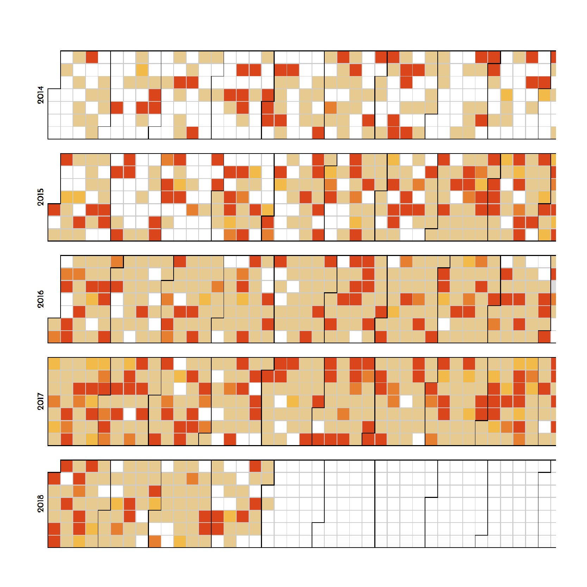

# Missing Migrants Calendar Heatmap

**Calendar Heatmap** | **Last updated: May 2018** | **Applicable data types: CSV or JSON** | **Author: [Hannah Friedrich]**

[Live Demo](http://geoviz.ceoas.oregonstate.edu/neocarto/modules/heatmap/calheatmap/index.html)

This tutorial will walk through how to create a calendar heatmap of CSV data using D3. This calendar heatmap shows frequency of
reported migrant deaths or missing people that have been reported since 2014.

## 1\. Set up the workspace
Set up workspace by getting csv with cleaned up columns of date and count. Include appropriate CDNs in header. See below.

## 2\. Data Sources
The data source used for this geovisualization is the [Missing Migrants] database. The database contains dates of events
that involved migrant deaths or injuries that have been reported.

## 3\. A function-by-function Tutorial
### CSS

    

### HTML
At the beginning within the body tag is the HTML:

    <body>
        

            <h1>Missing Migrants Calendar Heatmap</h1>
        

        <header>
            Mouse over the calendar to see the date and count of total reported migrant deaths and missing peoples.
        </header>

        

            

                

                    
This calendar heatmap shows the daily frequency of reported global migrant deaths or missing migrants from the <a href="http://missingmigrants.iom.int/" target="_blank"> Missing Migrant database</a>. The Missing
                    Migrant database has been recording instances of reported deaths or missing peoples reports since 2014. 

                

            

            

            

                
This calendar heatmap is built on D3 using calendar heatmap, which is inspired by Mike Bostock. This geovisualization was created by <a href="https://github.com/hannahfriedrich/MissingMigrantDateHeatmap" target="_blank"> Hannah Friedrich</a>.

            

            

        

        <section id="body"></section>

### CDNs
    <link href="https://fonts.googleapis.com/css?family=Josefin+Sans" rel="stylesheet">
    
    

### Javascript

        

## 4\. More examples of similiar geovisualizations
[Resuable Calendar Heatmap] allows the user to hover over individual cells which update the header information with
the cell value and date
[Heatmap with key] consists of a heatmap with a color key legend
[Vertical heatmap] is a similar construction of the heatmap with
[Alternative Calendar View] is a heatmap

## Acknowledgement
Thanks to Bo Zhao for helping me debug displaying the value in the mouse over function. Ahh!

## References
This tutorial is based on the calander heatmap examples created by [Micah Stubbs] and [Mike Bostock], which were made
with Version 4 of D3.

[Hannah Friedrich]: https://github.com/hannahfriedrich/MissingMigrantDateHeatmap
[Missing Migrants]: http://missingmigrants.iom.int/
[Micah Stubbs]: https://gist.github.com/micahstubbs/89c6bd879d64aa511372064c6cf85711
[Mike Bostock]: https://bl.ocks.org/mbostock/4063318
[Resuable Calendar Heatmap]: http://bl.ocks.org/eesur/5fbda7f410d31da35e42
[Heatmap with key]: https://bl.ocks.org/alansmithy/6fd2625d3ba2b6c9ad48
[Vertical heatmap]: https://bl.ocks.org/danbjoseph/13d9365450c27ed3bf5a568721296dcc
[Alternative Calendar View]: http://bl.ocks.org/KathyZ/c2d4694c953419e0509b
