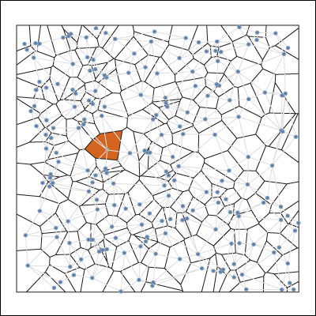

# D3 Voronoi Visualization

**Geoviz Type**: Tessellation | **Last Updated:** 09/22/2017 | **Applicable Type**: Voronoi Polygon Simulation | **Contributors:** [Mike Bostock](https://github.com/charwak/Bostock/)

[Live Demo](http://geoviz.ceoas.oregonstate.edu/neocarto/modules/vectors/polygons/voronoi_d3/index.html)

**Above:** *an image of a voronoi tessellation with 200 randomly derived points.*

The **D3 Voronoi Tessellation** is a polygon simulation written with d3 and based on Mike Bostock's interactive D3-Voronoi visualization (original source block located [here](https://bl.ocks.org/mbostock/4060366)). As a user moves their mouse throughout the image, new polygons are selected depending on the mouse's position. The link nodes and polygon boundaries of the polygon the mouse currently inhabits are updated interactively as the user moves their mouse across the image, and the selected polygon's color is shifted to an orange fill. Black lines indicate the Voronoi tessellations assigned to the random points, while gray lines denote links stretched between the centroids (points) of the polygons.

## 1\. Set-Up Workspace

No workspace set up is required to use this visualization, since the points created in this simulation are assigned randomly. Currently, the visualization is set to produce a series of 200 features, the number of which may be altered in line 29 of the accompanying index.html. 

## 2\. Data Sources

Due to the self-contained nature of the randomly-created point dataset used in this visualization, no data sources must be set to create an tessellation image.

## 3\. Visualization Tutorial

- html
  - Color attributes are set in lines 3 - 27 (style tag).
  - The SVG output footprint (400 px by 400 px) is set in line 29.
  - The *svg* variable is created and modified in lines 33 - 35.
  - The randomly created points (and the variable to hold them) are produced in lines 38 - 39.
    - If the user wishes to alter the number of points, the value inside the parenthesis at the end of line 38 may be adjusted.
  - The footprint to apply the d3 voronoi function is set in lines 41 - 42.
  - The polygons produced from the application of the d3 voronoi function to the randomly created points is appended as a group to the (previously blank) svg (lines 44 - 49, var polygon, class type polygon).
  - The links between the centroids (random points) representing the centers of the polygons (produced in the application of the d3 voronoi function) are also appended as a group to the svg (lines 51 - 56, var link, class type links).
  - The sites (random points) that fed into the d3 voronoi function are then appended as a group to the svg (lines 58 - 64, var site, class type sites).
  - In lines 66 - 68, the function moved() is created, saving the new position of the nearest site as the mouse is moved over them in index position 0 of the *sites* variable.
  - Function redraw() is set up in lines 71 - 76, setting a new variable *diagram* that is created as a duplicate of the d3 voronoi function applied to the *sites* variable. The current links and site (closest to the mouse pointer) are redrawn according to the mouse's current position (and removed as the mouse moves on to a new position and the site and its links are recalculated and redrawn to represent the new mouse position).
  - Function redrawPolygon() (lines 79 - 81) performs a similar service to the redraw() function, redrawing the polygon boundaries associated with the site currently being modified by the mouse pointer's position, creating an attribute *d* to hold the returned current mouse position.
  - The redrawLink function (lines 84 - 89) uses the start and ending path positions to redraw the links stored in the *diagram* variable.
  - In lines 92 - 95, the redrawSites function draws site positions modified from the original *diagram* variable.
- javascript
  - The d3 v5 library is called in line 30.
- css
  - Due to its stand-alone character, there is no css accompanying this tool.

## 4\. Additional Examples of Similar Geovisualizations

Rotating Voronoi: [link](https://bl.ocks.org/mbostock/4636377), created by Mike Bostock and inspired by work done by Mario Klingemann for displaying shifts in rotating voronoi polygons with rounded (rather than perpendicular) edges.

Interactive Voronoi Diagram Generator with WebGL, [link](http://alexbeutel.com/webgl/voronoi.html), is a JavaScript-based tool created by Alex Beutel that permits users to graphically select a series of points on screen, which are in turn used to create and display a voronoi tessellation.

Voronoi Diagram with Force Directed Nodes and Delauney Links, [link here,](https://gist.github.com/christophermanning/1734663) is a GitHub repository with d3-based code created by Christopher Manning and made available to the public for the creation of an aesthetic voronoi tessellation image.

## Acknowledgement

**Contributors:** [Mike Bostock](https://github.com/charwak/Bostock/) of d3 created the code used to generate this simulation.
